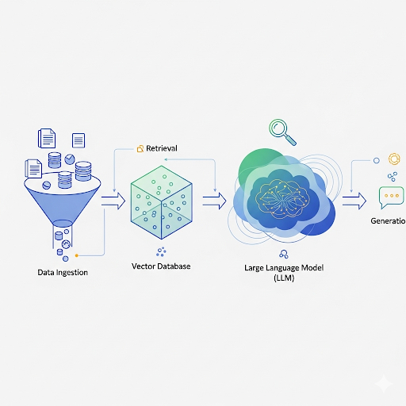

# 🧠 RagApp – End-to-End Retrieval-Augmented Generation (RAG) System

**RagApp** is a full-stack, extensible project for building **Retrieval-Augmented Generation (RAG)** systems — from data ingestion and vector indexing to LLM-based response generation and deployment.

---

<p align="center">
  
</p>

---

This repo is designed for:

* **Hands-on learning** (understand each piece of a RAG system)
* **Modular experimentation** (swap databases, embeddings, and chunking logic)
* **Scaling to production** (async pipelines, orchestration, and deployment)

> 🔧 **Version 2.0.0** is fully ready — complete migration to **PostgreSQL + PGVector**, dual vector DB support with Qdrant, custom chunking logic, and orchestration improvements.

---

## ✅ Highlights – Version 2.0.0

1. **Full Migration to PostgreSQL + PGVector** ✅

   * MongoDB fully replaced.
   * PGVector now fully implemented for vector search.

2. **Dual Vector DB Support** 🟢

   * Qdrant remains fully functional alongside PGVector.
   * Developers can **switch between PGVector and Qdrant** easily via a single `.env` variable (`VECTOR_DB_PROVIDER`).
   * Unified interface ensures seamless vector DB operations.

3. **Custom Chunking Logic** ✂️

   * LangChain is no longer required.
   * Custom chunking tailored to RagApp’s workflow for better performance and flexibility.
   * Developers can optionally enable LangChain chunking if desired.

4. **Orchestration & Performance Improvements** ⚡

   * Optimized async pipelines and indexing workflows.
   * Faster and more robust search and ingestion.

5. **Deployment Ready** 🚀

   * v2 backend is fully stable.
   * Next steps: integrate **Celery + Redis** for distributed task management and scaling.

---

## 📦 Tech Stack (v2)

* **Backend**: FastAPI + Uvicorn (async-first, OpenAPI-ready)
* **Vector DB**: PostgreSQL + PGVector (primary) + Qdrant (optional, fully supported)
* **Embeddings / LLMs**: OpenAI, Ollama, Cohere, Sentence Transformers
* **Chunking**: Custom logic (LangChain optional)
* **Dockerized services**: PostgreSQL, Qdrant
* **Unified vector DB interface** (switch PGVector ↔ Qdrant via `.env`)

---

## ⚡ Quickstart

### 1. Clone & Setup

```bash
git clone https://github.com/silvaxxx1/RagApp.git
cd RagApp
```

### 2. Install Dependencies

```bash
uv init
uv add -r requirements.txt
```

### 3. Configure Environment Variables

```bash
cp uv.example .env
```

* Set API keys for OpenAI, Ollama, etc.
* Choose your vector DB provider:

```env
VECTOR_DB_PROVIDER=pgvector   # or "qdrant"
```

### 4. Run Services (Docker)

```bash
cd docker
docker-compose up -d
```

### 5. Run the Backend

```bash
uvicorn main:app --reload --host 0.0.0.0 --port 5000
```

Access Swagger UI → [http://localhost:5000/docs](http://localhost:5000/docs)

---

## 🗺️ Roadmap (v2.0.0)

* [x] Full migration to PostgreSQL + PGVector
* [x] Dual vector DB support (PGVector + Qdrant)
* [x] Unified DB interface for seamless switching
* [x] Custom chunking logic implemented (LangChain optional)
* [x] Orchestration & async pipeline improvements
* [ ] Background tasks with Celery + Redis
* [ ] Advanced RAG strategies (re-ranking, hybrid, multi-query)
* [ ] Production deployment templates (Docker/K8s, CI/CD)

---

## 🤝 Contributing

Fork, clone, and build along!
Ideas, PRs, and discussions are welcome as we evolve RagApp into a **production-grade RAG template** for the community.

---

## 📄 License

MIT License – see [LICENSE](./LICENSE)

---

This README now clearly communicates:

* **v2 is fully ready** ✅
* **PGVector fully implemented** and MongoDB removed
* **Dual vector DB** support with easy switching via `.env`
* **Custom chunking** replaces LangChain but remains optional
* **Orchestration and async pipelines improved**

---
